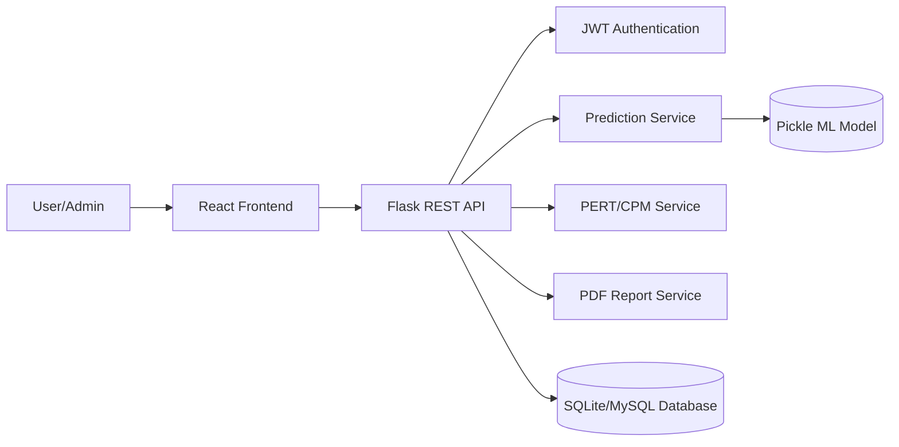
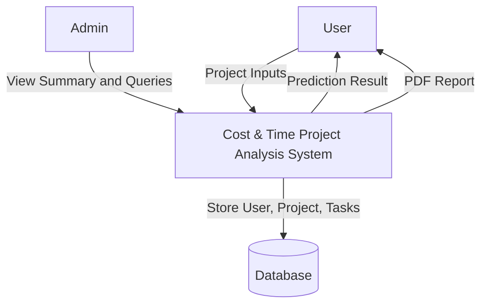
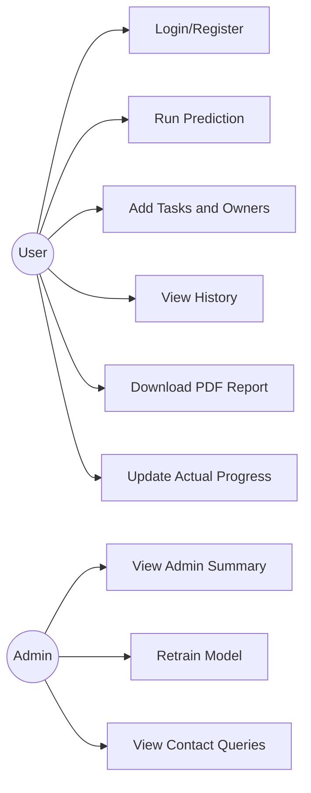
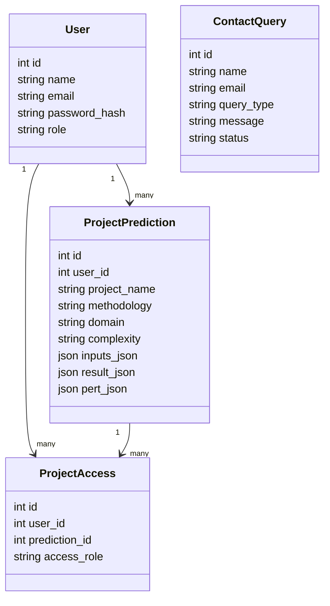
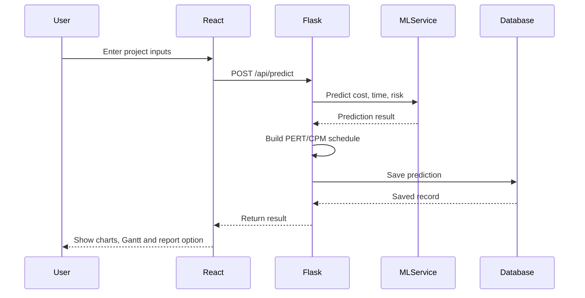
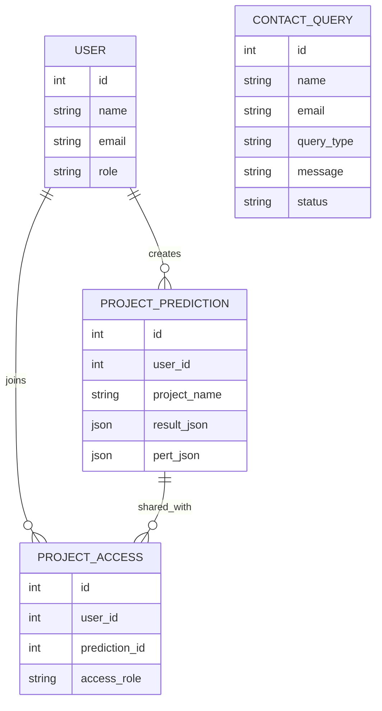

# Cost & Time Project Analysis

## B.Tech IT Project Report

### 1. Title Page

**Project Title:** Cost & Time Project Analysis  
**Submitted by:** Gaikwad Vaishnavi  
**Roll No.:** ____________________  
**Degree:** B.Tech in Information Technology  
**Department:** Information Technology  
**University Name:** ____________________  
**Institute Name:** ____________________  
**Academic Year:** 2025-2026  
**Project Guide:** ____________________  

---

### 2. Certificate

This is to certify that the project report titled **"Cost & Time Project Analysis"** is the bonafide work of **Gaikwad Vaishnavi**, carried out in partial fulfillment of the requirements for the degree of **Bachelor of Technology in Information Technology**.

The project has been completed under my supervision and guidance. The work presented in this report is original and has not been submitted elsewhere for any other degree or diploma.

**Project Guide Name and Signature:** ____________________  
**Head of Department Signature:** ____________________  
**External Examiner Signature:** ____________________  
**Date:** ____________________  

---

### 3. Declaration

I hereby declare that the project work entitled **"Cost & Time Project Analysis"** submitted by me is an authentic record of my own work carried out under the guidance of my project guide.

The information presented in this report is true to the best of my knowledge. This project has not been submitted previously to any university or institute for the award of any degree or diploma.

**Student Name:** Gaikwad Vaishnavi  
**Student Signature:** ____________________  
**Date:** ____________________  

---

### 4. Acknowledgment

I would like to express my sincere gratitude to my project guide for continuous guidance, valuable suggestions and support throughout the development of this project.

I am thankful to the Head of Department, faculty members and my institute for providing the required facilities and learning environment. I also thank my classmates, friends and all contributors who helped directly or indirectly during project development.

Finally, I would like to thank my family for their motivation and constant encouragement.

---

### 5. Abstract

Software project estimation is a critical activity in project management because inaccurate cost and time prediction can lead to budget overruns, delayed delivery and poor resource planning. Traditional estimation methods often depend on manual judgment, previous experience and incomplete project information. This creates difficulty for project managers in identifying risk, assigning team members and monitoring actual project progress.

The proposed system, **Cost & Time Project Analysis**, is a web-based project estimation and planning platform. It predicts project cost, completion timeline, risk level, recommended team size and success probability using machine learning techniques. The system uses Random Forest Regression and a neural-network based MLP regressor for nonlinear estimation. It also integrates PERT, CPM and Gantt chart planning to calculate expected duration, critical path, slack and schedule risk.

The project includes user authentication, project history tracking, task ownership, team profiles, actual vs predicted variance tracking, contact query management, PDF report generation and an admin dashboard. The system is developed using React for the frontend, Flask REST API for the backend and SQLite/MySQL for database storage. The project helps users make data-driven decisions for cost control, timeline planning and project risk management.

---

### 6. Table of Contents

| Chapter No. | Title | Page No. |
|---|---|---|
| 1 | Introduction | ___ |
| 2 | Literature Review | ___ |
| 3 | System Analysis | ___ |
| 4 | System Design | ___ |
| 5 | Implementation | ___ |
| 6 | Testing | ___ |
| 7 | Results and Discussion | ___ |
| 8 | Conclusion and Future Work | ___ |
| 9 | References | ___ |
| 10 | Appendices | ___ |

---

### 7. List of Figures

| Figure No. | Figure Name |
|---|---|
| 4.1 | System Architecture Diagram |
| 4.2 | Data Flow Diagram Level 0 |
| 4.3 | Use Case Diagram |
| 4.4 | Class Diagram |
| 4.5 | Sequence Diagram |
| 4.6 | Entity Relationship Diagram |
| 5.1 | Home Page Screenshot |
| 5.2 | Prediction Page Screenshot |
| 5.3 | Dashboard Page Screenshot |
| 5.4 | Admin Dashboard Screenshot |

---

### 8. List of Tables

| Table No. | Table Name |
|---|---|
| 3.1 | Functional Requirements |
| 3.2 | Non-functional Requirements |
| 5.1 | Technology Stack |
| 6.1 | Test Cases |
| 7.1 | Comparative Analysis |

---

### 9. List of Abbreviations

| Abbreviation | Full Form |
|---|---|
| API | Application Programming Interface |
| CPM | Critical Path Method |
| DFD | Data Flow Diagram |
| ER | Entity Relationship |
| GUI | Graphical User Interface |
| JWT | JSON Web Token |
| ML | Machine Learning |
| MLP | Multilayer Perceptron |
| PDF | Portable Document Format |
| PERT | Program Evaluation and Review Technique |
| REST | Representational State Transfer |
| SQL | Structured Query Language |
| UI | User Interface |

---

# Main Content

## Chapter 1: Introduction

### 1.1 Background of the Project

Project cost and timeline estimation is one of the most important stages in software project management. A wrong estimate can affect budget planning, resource allocation, client satisfaction and project success. Many project teams still use manual estimation methods that depend on guesswork, limited historical data and subjective judgment.

Modern project management requires intelligent estimation systems that can analyze project complexity, number of features, team experience, external risks and actual progress. The proposed system addresses this need by combining machine learning prediction with project planning techniques such as PERT, CPM and Gantt charts.

### 1.2 Problem Statement

Many software projects fail to meet their planned budget and deadline because project cost, time and risk are not estimated accurately at the beginning. Task ownership is often unclear, project progress is not monitored in real time and risks are identified late. There is a need for a system that can predict cost and timeline, track project progress, identify high-risk tasks and generate useful project reports.

### 1.3 Objectives

- To predict software project cost using machine learning.
- To predict project completion timeline in weeks.
- To identify project risk level and success probability.
- To recommend suitable team size.
- To calculate PERT expected duration and CPM critical path.
- To display interactive Gantt chart planning.
- To track project history and task ownership.
- To compare actual cost/time with predicted cost/time.
- To generate downloadable PDF reports.
- To provide an admin dashboard for monitoring users, predictions and contact queries.

### 1.4 Scope

The scope of this project includes web-based project estimation, authenticated user access, project prediction, project history tracking, report generation, admin monitoring and deployment-ready architecture. The system can be used for software projects and can be extended to infrastructure-style planning by using external risk factors such as weather risk, vendor reliability and regulatory delay risk.

### 1.5 Motivation

The motivation behind this project is to reduce manual estimation errors and provide a practical decision-support tool for project managers, developers and students. By using prediction models and planning algorithms, the system helps users understand expected cost, timeline, risk and corrective actions.

---

## Chapter 2: Literature Review

### 2.1 Review of Existing Systems

Existing project estimation systems commonly use methods such as expert judgment, analogy-based estimation, COCOMO, function point analysis and spreadsheet-based planning. Some project management tools provide Gantt charts and task assignment, but they often do not combine prediction, risk analysis and actual variance tracking in a single platform.

### 2.2 Existing Research

Software cost estimation research shows that machine learning algorithms such as Random Forest, Support Vector Regression, Neural Networks and Ensemble Models can improve estimation accuracy when sufficient project data is available. Project scheduling methods such as PERT and CPM are widely used to identify task dependencies and critical paths.

### 2.3 Comparison of Existing Solutions

| System/Method | Features | Limitations |
|---|---|---|
| Manual Estimation | Simple and quick | Depends on experience, high error risk |
| COCOMO | Structured cost estimation | Requires accurate project size and calibration |
| Spreadsheet Planning | Easy to maintain | Limited automation and risk analytics |
| Project Management Tools | Task tracking and Gantt charts | Limited cost prediction and ML support |
| Proposed System | ML prediction, PERT, CPM, Gantt, history, reports | Accuracy depends on training data quality |

### 2.4 Identified Gaps

- Lack of integrated cost and timeline prediction.
- Limited real-time risk monitoring.
- Limited project history and report generation.
- Poor visibility of task ownership and progress.
- Lack of actual vs predicted variance tracking.

---

## Chapter 3: System Analysis

### 3.1 Existing System

In the existing manual system, project managers estimate cost and duration based on experience, previous project records or spreadsheet calculations. Task dependencies and risks are often analyzed separately. This makes the planning process slow, less accurate and difficult to monitor.

### 3.2 Proposed System

The proposed system is a full-stack web application that predicts project cost, timeline, team size, risk level and success probability. It supports authentication, project prediction, PERT/CPM scheduling, Gantt chart visualization, project history, variance tracking and PDF report generation.

### 3.3 Feasibility Study

#### Technical Feasibility

The project is technically feasible because it uses widely available technologies such as React, Flask, SQLAlchemy, SQLite/MySQL and scikit-learn. The system can run locally and can also be deployed using Render and Vercel.

#### Economic Feasibility

The system is cost-effective because it uses open-source tools and libraries. It does not require paid APIs for basic functionality.

#### Operational Feasibility

The system is user-friendly and can be used by students, project managers and developers. The dashboard and forms are designed to be simple and understandable.

### 3.4 Requirement Analysis

#### Functional Requirements

| Requirement ID | Requirement |
|---|---|
| FR1 | User registration and login |
| FR2 | Project cost prediction |
| FR3 | Project timeline prediction |
| FR4 | Risk level prediction |
| FR5 | Recommended team size |
| FR6 | PERT/CPM task planning |
| FR7 | Gantt chart visualization |
| FR8 | Project history tracking |
| FR9 | PDF report generation |
| FR10 | Admin dashboard |
| FR11 | Contact query saving |
| FR12 | Actual vs predicted variance tracking |

#### Non-functional Requirements

| Requirement ID | Requirement |
|---|---|
| NFR1 | Responsive user interface |
| NFR2 | Secure JWT authentication |
| NFR3 | Fast prediction response |
| NFR4 | Maintainable code structure |
| NFR5 | Scalable backend API |
| NFR6 | Reliable database storage |
| NFR7 | User-friendly dashboard |

---

## Chapter 4: System Design

### 4.1 Architecture Diagram



### 4.2 Data Flow Diagram Level 0



### 4.3 Use Case Diagram



### 4.4 Class Diagram



### 4.5 Sequence Diagram



### 4.6 Entity Relationship Diagram



### 4.7 Database Design

Main database tables:

- User
- ProjectPrediction
- ProjectAccess
- ContactQuery

The database stores authentication data, project inputs, prediction results, PERT/CPM tasks, project sharing records and contact queries.

---

## Chapter 5: Implementation

### 5.1 Technologies Used

| Layer | Technology |
|---|---|
| Frontend | React, Vite, CSS, Recharts, Framer Motion |
| Backend | Flask, Flask REST API |
| Database | SQLite / MySQL |
| Authentication | JWT |
| Machine Learning | scikit-learn, Random Forest, MLPRegressor |
| Report Generation | ReportLab |
| Deployment | Vercel, Render |

### 5.2 Modules Description

#### Authentication Module

This module handles user registration, login and JWT token-based access control. The first registered user becomes admin.

#### Prediction Module

This module accepts project inputs and predicts cost, timeline, risk level, team size and success probability.

#### PERT/CPM Module

This module calculates expected task duration, early start, early finish, late start, late finish, slack and critical path.

#### Gantt Chart Module

This module visualizes project schedule, task duration, progress and critical tasks.

#### Dashboard Module

The dashboard shows project history, risk analytics, portfolio trends, team profiles and variance tracking.

#### Admin Module

The admin dashboard displays users, predictions, contact queries and model training controls.

#### Contact Module

The contact form stores user queries in the database so the admin can review them.

#### PDF Report Module

This module generates downloadable PDF reports for project predictions.

### 5.3 Algorithms

#### Random Forest Regression

Random Forest Regression is used to predict multiple target values such as project cost, timeline, team size and success probability. It works by combining multiple decision trees and averaging their predictions.

#### MLP Neural Regressor

The MLPRegressor is a neural-network based model used to capture nonlinear patterns in project data. It contains multiple hidden layers and uses ReLU activation.

#### PERT Formula

Expected Time:

```text
TE = (Optimistic + 4 * Most Likely + Pessimistic) / 6
```

Variance:

```text
Variance = ((Pessimistic - Optimistic) / 6)^2
```

#### CPM

CPM identifies the critical path by calculating early start, early finish, late start, late finish and slack for each task.

### 5.4 Screenshots of System

Add the following screenshots in the final Word report:

- Home Page
- Login Page
- Prediction Page
- Prediction Result Page
- Gantt Chart
- Dashboard
- Variance Tracker
- Admin Dashboard
- Contact Page
- PDF Report

---

## Chapter 6: Testing

### 6.1 Test Plan

The system was tested using functional testing, UI testing, API testing and validation testing. Each major module was tested separately and then integrated.

### 6.2 Test Cases

| Test ID | Test Case | Input | Expected Output | Status |
|---|---|---|---|---|
| TC01 | Register user | Name, email, password | User account created | Pass |
| TC02 | Login user | Email, password | JWT token generated | Pass |
| TC03 | Run prediction | Project inputs | Cost/time/risk output | Pass |
| TC04 | Add PERT tasks | Task details | CPM/Gantt generated | Pass |
| TC05 | Download report | Prediction ID | PDF downloaded | Pass |
| TC06 | Join project | Project access code | Shared project access | Pass |
| TC07 | Update task progress | Progress percentage | Dashboard updated | Pass |
| TC08 | Save contact query | Contact form data | Query saved in database | Pass |
| TC09 | Admin summary | Admin login | Summary displayed | Pass |
| TC10 | Variance tracker | Actual cost/time/progress | Variance calculated | Pass |

### 6.3 Results and Analysis

The system successfully performs user authentication, prediction, report generation, PERT/CPM calculation and dashboard visualization. The UI is responsive and supports project management workflows.

### 6.4 Performance Evaluation

Prediction response is fast because the trained model is loaded from a pickle file. The use of REST API separates frontend and backend responsibilities, improving maintainability.

---

## Chapter 7: Results and Discussion

### 7.1 Output Screens

The system produces the following outputs:

- Estimated project cost
- Estimated timeline
- Risk level
- Recommended team size
- Success probability
- Critical path
- Gantt chart
- Project health score
- Actual vs predicted variance
- PDF report

### 7.2 Comparative Analysis

| Parameter | Manual Estimation | Proposed System |
|---|---|---|
| Cost Prediction | Experience based | ML based |
| Timeline Prediction | Manual calculation | ML + PERT/CPM |
| Risk Analysis | Limited | Automated risk scoring |
| Task Ownership | Manual | Dashboard based |
| Report Generation | Manual | PDF download |
| Progress Tracking | Basic | Actual vs predicted variance |

### 7.3 Interpretation of Results

The project provides a structured way to estimate and monitor software projects. It improves visibility of cost, schedule and risk. The use of task ownership and variance tracking helps in identifying project delays and budget deviations early.

---

## Chapter 8: Conclusion and Future Work

### 8.1 Summary of Work

The Cost & Time Project Analysis system was successfully developed as a full-stack web application. It combines machine learning prediction, project scheduling, dashboard analytics and report generation.

### 8.2 Achievements

- Implemented cost and timeline prediction.
- Added risk level and success probability analysis.
- Implemented PERT, CPM and Gantt chart.
- Added user authentication and project history.
- Added task ownership and team profile tracking.
- Added actual vs predicted variance tracker.
- Added contact query management.
- Added admin dashboard and PDF report generation.

### 8.3 Limitations

- Prediction accuracy depends on dataset quality.
- The bundled dataset is suitable for demonstration.
- Email sending is not integrated; contact queries are stored in database.
- Real-time external APIs are not connected.

### 8.4 Future Enhancements

- Add TensorFlow/Keras deep learning model.
- Add cloud MySQL database deployment.
- Add email notification system.
- Add role-based permissions for manager and viewer.
- Add project comparison page.
- Add live integration with issue tracking tools.
- Add advanced analytics for dataset quality and model explainability.

---

## References

1. B. W. Boehm, "Software Engineering Economics," Prentice Hall, 1981.
2. L. Breiman, "Random Forests," Machine Learning, 2001.
3. Scikit-learn Documentation, "RandomForestRegressor and MLPRegressor," 2026.
4. Flask Documentation, "Flask Web Development Framework," 2026.
5. React Documentation, "React Frontend Library," 2026.
6. ReportLab Documentation, "PDF Generation in Python," 2026.
7. Project Management Institute, "A Guide to the Project Management Body of Knowledge," PMI.

---

## Appendices

### Appendix A: API Documentation

| Method | Endpoint | Description |
|---|---|---|
| POST | /api/auth/register | Register user |
| POST | /api/auth/login | Login user |
| GET | /api/auth/me | Get logged-in user |
| POST | /api/predict | Create project prediction |
| GET | /api/history | Get project history |
| GET | /api/problems | Get project problems |
| POST | /api/pert-cpm | Calculate PERT/CPM |
| GET | /api/reports/{id} | Download PDF report |
| POST | /api/projects/join | Join shared project |
| PATCH | /api/projects/{id}/tasks/{taskId} | Update task progress |
| PATCH | /api/projects/{id}/actuals | Update actual cost/time/progress |
| POST | /api/contact | Save contact query |
| GET | /api/admin/summary | Admin summary |

### Appendix B: User Manual

1. Open the application.
2. Register or login.
3. Go to Prediction page.
4. Enter project details.
5. Add PERT/CPM tasks.
6. Run prediction.
7. View result, Gantt chart and recommendations.
8. Download PDF report.
9. Open Dashboard for history and variance tracking.
10. Admin can view contact queries and train model.

### Appendix C: Deployment Steps

Backend:

```powershell
cd backend
pip install -r requirements.txt
python run.py
```

Frontend:

```powershell
cd frontend
npm install
npm run dev
```

Production:

- Backend can be deployed on Render.
- Frontend can be deployed on Vercel.
- Set `VITE_API_URL` in frontend environment variables.
- Set `FRONTEND_URLS`, `SECRET_KEY`, `JWT_SECRET_KEY` and `DATABASE_URL` in backend environment variables.

### Appendix D: Formatting Guidelines

- Font: Times New Roman
- Normal text size: 12
- Heading size: 14 to 16 bold
- Line spacing: 1.5
- Left margin: 1.5 inch
- Other margins: 1 inch
- Page number: bottom center or bottom right
